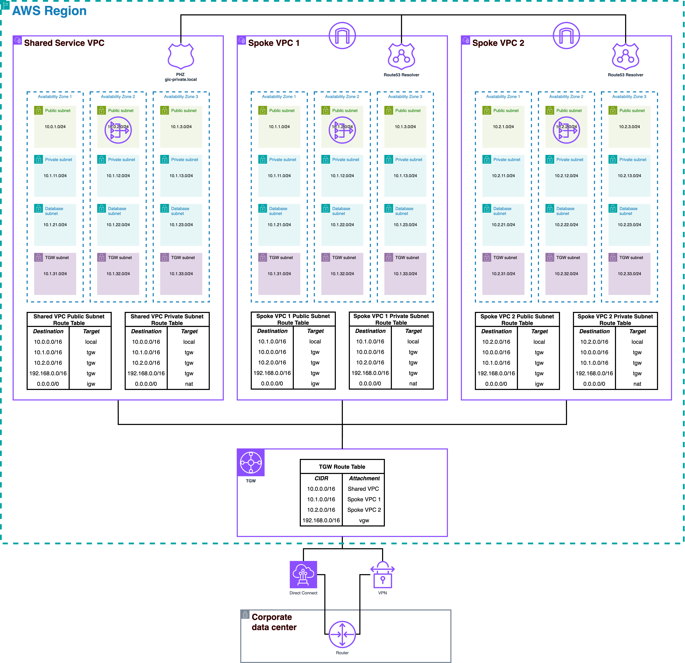

# Hub and Spoke VPC Architecture with Distributed ALB and WAF

This Terraform configuration creates a hub and spoke VPC architecture on AWS with distributed Application Load Balancer (ALB), centralized WAF protection, and comprehensive security features.

## 🏗️ Architecture Overview

This infrastructure creates a modern, scalable hub-and-spoke network architecture with:

- **3 VPCs**: 1 shared services VPC (hub) and 2 spoke VPCs
- **Distributed ALB**: Load balancer in Spoke1 VPC for direct access to App1
- **Centralized WAF**: Comprehensive web application firewall protection
- **Transit Gateway**: Central connectivity hub for inter-VPC communication
- **Route53**: Private hosted zone with DNS resolution across all VPCs
- **VPC Endpoints**: Optional AWS service endpoints (disabled by default for cost optimization)
- **Multi-AZ Deployment**: Each VPC spans 3 availability zones
- **Security Monitoring**: VPC Flow Logs with KMS encryption

## 🎯 Current Architecture (Distributed ALB)

```
Internet → ALB (Spoke1 VPC) → App1 (Nginx with WAF protection)
Internet → Direct DNS       → App2 (Independent Apache server)
```

### Application Distribution

#### **App1 (Spoke1 VPC) - Web Application**
- **Service**: Nginx web server with security testing endpoints
- **Access**: ALB + Direct DNS
- **Protection**: Full WAF protection (OWASP Top 10, rate limiting, geo-blocking)
- **URLs**:
  - Main app: `http://<ALB-DNS>/`
  - Health: `http://<ALB-DNS>/health`
  - Admin: `http://<ALB-DNS>/admin`
  - Security tests: `http://<ALB-DNS>/test-sql`, `http://<ALB-DNS>/test-xss`

#### **App2 (Spoke2 VPC) - Test Instance**
- **Service**: Apache test server
- **Access**: Direct DNS only (`test-spoke2.gic-private.local`)
- **Protection**: Security Groups only
- **Purpose**: Independent connectivity and DNS testing

## 🚀 Benefits of Distributed ALB Architecture

### **Performance Improvements**
- ✅ **Reduced Latency**: No Transit Gateway overhead for ALB traffic
- ✅ **Better Health Checks**: Direct VPC routing, faster response times
- ✅ **Improved Reliability**: No cross-VPC dependencies for primary traffic

### **Architectural Benefits**
- ✅ **Clearer Separation**: App1 (web service) vs App2 (test instance)
- ✅ **Simplified Routing**: Direct routing, no complex path-based rules
- ✅ **Independent Scaling**: Each app can scale independently

### **Security & Operations**
- ✅ **Centralized WAF**: Single point of security rule management
- ✅ **Easier Troubleshooting**: Direct routing paths
- ✅ **Reduced Complexity**: Fewer moving parts

## 🛡️ AWS WAF Protection

### **Rule Priority Order**
1. **Allow Specific IPs** (Priority 1) - Bypasses all other rules
2. **Block Specific IPs** (Priority 2) - Always blocked
3. **Geographic Blocking** (Priority 3) - Country-based blocking
4. **Rate Limiting** (Priority 10) - Request throttling
5. **AWS Managed Rules** (Priority 20-24) - OWASP Top 10, SQL injection, XSS
6. **Custom Rules** (Priority 30-31) - Application-specific rules

### **Security Features**
- **OWASP Top 10**: Core web application vulnerabilities
- **Rate Limiting**: 2000 requests/5 minutes per IP (configurable)
- **Geographic Blocking**: Block specific countries (CN, RU, KP)
- **IP Allow/Block Lists**: Granular IP-based control
- **SQL Injection Protection**: Database attack prevention
- **XSS Protection**: Cross-site scripting prevention
- **Admin Panel Protection**: Secure admin interfaces

## 📊 Network Topology

```
┌─────────────────┐    ┌─────────────────┐    ┌─────────────────┐
│   Spoke VPC 1   │    │  Shared VPC     │    │   Spoke VPC 2   │
│   10.1.0.0/16   │    │  (Hub)          │    │   10.2.0.0/16   │
│                 │    │  10.0.0.0/16    │    │                 │
│  ┌─────────────┐│    │                 │    │                 │
│  │ ALB + WAF   ││    │  VPC Endpoints* │    │  Test Instance  │
│  │ App1 (Nginx)││    │  Route53        │    │  App2 (Apache)  │
│  └─────────────┘│    │  DNS Resolver   │    │                 │
└─────────┬───────┘    └─────────┬───────┘    └─────────┬───────┘
          │                      │                      │
          │                      │                      │
          └──────────────────────┼──────────────────────┘
                                 │
                    ┌─────────────┴─────────────┐
                    │    Transit Gateway        │
                    │                           │
                    │  • Route Tables           │
                    │  • VPC Attachments        │
                    │  • Cross-VPC Routing      │
                    └───────────────────────────┘
```

**Note:** *VPC Endpoints are optional and disabled by default to save ~$63-135/month. Your instances can access AWS services via NAT Gateway.

## 🏛️ Visual Architecture Diagram

The following diagram provides a detailed visual representation of the complete hub-and-spoke architecture, showing all VPCs, subnets, route tables, and networking components with their CIDR blocks and connectivity:



### **Key Components Illustrated:**
- **Shared Services VPC (Hub)**: Central hub with Route53 resolver, optional VPC endpoints, and Transit Gateway attachment
- **Spoke VPC 1**: Contains ALB with WAF protection and App1 (Nginx) with full multi-AZ deployment
- **Spoke VPC 2**: Contains App2 (Apache) test instance with independent DNS access
- **Transit Gateway**: Central connectivity hub with dedicated route tables for inter-VPC communication
- **Route Tables**: Detailed routing configuration showing public, private, database, and TGW subnet routing
- **CIDR Allocation**: Complete IP addressing scheme across all VPCs and subnets
- **Security Groups**: Network-level security controls for each component
- **Multi-AZ Design**: All components deployed across multiple availability zones for high availability

This visual representation complements the text-based network topology above and provides a comprehensive view of the infrastructure's networking architecture, security boundaries, and traffic flows.

## 🔧 Prerequisites

- Terraform >= 1.12.0
- AWS CLI configured with appropriate permissions
- AWS Provider version 6.0.0
- AWS credentials with permissions for:
  - EC2, VPC, Transit Gateway, Route53, IAM
  - Application Load Balancer, WAF, CloudWatch

## 🚀 Quick Start

### 1. **Clone and Configure**
```bash
git clone <repository-url>
cd hub-spoke-shared-vpc

# Copy and customize configuration
cp terraform.tfvars.example terraform.tfvars
# Edit terraform.tfvars with your desired values
```

### 2. **Deploy Infrastructure**
```bash
# Initialize Terraform
terraform init

# Review deployment plan
terraform plan

# Deploy (estimated time: 8-12 minutes)
terraform apply
```

### 3. **Access Your Applications**
```bash
# Get ALB DNS name from outputs
terraform output web_application_urls

# Test App1 (with WAF protection)
curl http://<ALB-DNS-NAME>/

# Test WAF protection
curl "http://<ALB-DNS-NAME>/test-sql?id=1' OR '1'='1"
# Should be blocked by WAF
```

## 📂 Instance Initialization Scripts

This infrastructure includes external initialization scripts for EC2 instances, located in the `scripts/` directory. These scripts avoid the 16KB user data limit and improve maintainability.

### **Scripts Directory Structure**
```
scripts/
├── spoke1-init.sh     # nginx web server setup for App1
└── spoke2-init.sh     # Apache test server setup for App2
```

### **spoke1-init.sh (App1 - Web Application)**
- **Purpose**: Initializes the spoke1 test instance with nginx web server
- **Services**: nginx web server, CloudWatch agent
- **Use Case**: Primary web application behind ALB with WAF protection
- **Endpoints**: Health checks, admin panel, API endpoints for WAF testing
- **Features**:
  - Comprehensive web server with security test endpoints
  - CloudWatch monitoring integration
  - Cross-VPC connectivity testing utilities
  - DNS diagnostics and network testing tools

### **spoke2-init.sh (App2 - Test Instance)**
- **Purpose**: Initializes the spoke2 test instance with Apache web server
- **Services**: Apache web server, CloudWatch agent
- **Use Case**: Independent connectivity testing instance
- **Endpoints**: Health checks, system info, basic web server
- **Features**:
  - Simple Apache web server for connectivity testing
  - CloudWatch monitoring integration
  - Cross-VPC communication testing
  - DNS resolution testing

### **Template Variables**
The scripts use Terraform template variables for dynamic configuration:
- `${DOMAIN_NAME}` - Private DNS domain name (e.g., "gic-private.local")

### **Benefits of External Scripts**
1. **Avoids 16KB user data limit** - Complex initialization scripts can exceed EC2's inline user data size limit
2. **Better maintainability** - Scripts can be version controlled and easily modified
3. **Improved readability** - Separates infrastructure code from application setup
4. **Easier debugging** - Scripts can be tested independently
5. **Modular architecture** - Each VPC gets its own specific initialization

### **Usage in Terraform**
The scripts are automatically referenced by Terraform's `templatefile()` function:

```hcl
user_data_base64 = base64encode(templatefile("${path.module}/scripts/${each.key}-init.sh", {
  DOMAIN_NAME = var.domain_name
}))
```

The scripts run automatically when instances are launched and include comprehensive setup for both applications and monitoring.

## 📋 Input Variables

| Variable | Description | Type | Default |
|----------|-------------|------|---------|
| `aws_region` | AWS Region for deployment | `string` | `"ap-southeast-1"` |
| `project_name` | Project name used as identifier | `string` | `"hub-spoke-vpc"` |
| `environment` | Environment name | `string` | `"dev"` |
| `shared_vpc_cidr` | CIDR block for shared VPC | `string` | `"10.0.0.0/16"` |
| `spoke_vpc_cidrs` | Map of spoke VPC CIDR blocks | `map(string)` | See variables.tf |
| `domain_name` | Domain for private hosted zone | `string` | `"gic-private.local"` |
| `enable_nat_gateway` | Enable NAT Gateway | `bool` | `true` |
| `single_nat_gateway` | Use single NAT Gateway (cost optimization) | `bool` | `true` |
| `create_test_instances` | Create test EC2 instances | `bool` | `true` |
| `test_instance_type` | Test instance type | `string` | `"t2.micro"` |
| `test_instance_vpcs` | List of VPCs for test instances | `list(string)` | `["spoke1", "spoke2"]` |
| `enable_vpc_flow_logs` | Enable VPC Flow Logs | `bool` | `true` |
| `flow_logs_retention_days` | CloudWatch retention period | `number` | `7` |
| `enable_waf` | Enable AWS WAF protection | `bool` | `true` |
| `waf_rate_limit` | WAF rate limit (requests/5min) | `number` | `2000` |
| `waf_blocked_countries` | Countries to block | `list(string)` | `["CN", "RU", "KP"]` |
| `waf_allowed_ips` | IP addresses to always allow | `list(string)` | `[]` |
| `waf_blocked_ips` | IP addresses to always block | `list(string)` | `[]` |

## 📤 Key Outputs

| Output | Description |
|--------|-------------|
| `web_application_urls` | URLs to access App1 through ALB |
| `direct_instance_access` | Direct DNS access to both apps |
| `alb_dns_name` | ALB DNS name for App1 |
| `waf_web_acl_arn` | WAF Web ACL ARN |
| `vpc_ids` | Map of VPC names to IDs |
| `transit_gateway_id` | Transit Gateway ID |
| `route53_private_zone_id` | Private hosted zone ID |
| `vpc_flow_logs` | VPC Flow Logs configuration |
| `test_instances` | Map of test instances information |
| `connectivity_test_commands` | Commands for testing connectivity |

## 🌐 CIDR Allocation

### Shared VPC (10.0.0.0/16)
- **Public subnets**: 10.0.1.0/24, 10.0.2.0/24, 10.0.3.0/24
- **Private subnets**: 10.0.11.0/24, 10.0.12.0/24, 10.0.13.0/24
- **Database subnets**: 10.0.21.0/24, 10.0.22.0/24, 10.0.23.0/24
- **TGW subnets**: 10.0.31.0/24, 10.0.32.0/24, 10.0.33.0/24

### Spoke VPC 1 (10.1.0.0/16) - App1
- **Public subnets**: 10.1.1.0/24, 10.1.2.0/24, 10.1.3.0/24 (ALB placement)
- **Private subnets**: 10.1.11.0/24, 10.1.12.0/24, 10.1.13.0/24 (App1 instance)
- **Database subnets**: 10.1.21.0/24, 10.1.22.0/24, 10.1.23.0/24
- **TGW subnets**: 10.1.31.0/24, 10.1.32.0/24, 10.1.33.0/24

### Spoke VPC 2 (10.2.0.0/16) - App2
- **Public subnets**: 10.2.1.0/24, 10.2.2.0/24, 10.2.3.0/24
- **Private subnets**: 10.2.11.0/24, 10.2.12.0/24, 10.2.13.0/24 (App2 instance)
- **Database subnets**: 10.2.21.0/24, 10.2.22.0/24, 10.2.23.0/24
- **TGW subnets**: 10.2.31.0/24, 10.2.32.0/24, 10.2.33.0/24

## 🔀 Routing Architecture

### **Public Subnets**
- Default route (0.0.0.0/0) → Internet Gateway
- Cross-VPC routes → Transit Gateway

### **Private Subnets**
- Default route (0.0.0.0/0) → NAT Gateway
- Cross-VPC routes → Transit Gateway

### **Database Subnets**
- Cross-VPC routes only → Transit Gateway
- No internet access (secure)

### **Transit Gateway Routing**
- **Shared Route Table**: Associated with shared VPC
- **Spoke Route Table**: Associated with spoke VPCs
- **Propagation**: Automatic route propagation between VPCs

## 🔒 Security Features

### **Network Security**
- **Security Groups**: Least privilege access control
- **ICMP Disabled**: Ping protocol blocked for enhanced security
- **NACLs**: Additional subnet-level protection
- **Private Endpoints**: S3 and DynamoDB access without internet
- **VPC Flow Logs**: Network traffic monitoring with KMS encryption

### **Application Security**
- **WAF Protection**: OWASP Top 10, rate limiting, geo-blocking
- **SSL/TLS Ready**: HTTPS support (certificate not included)
- **Admin Panel Protection**: Secure administrative interfaces

### **Access Control**
- **SSM Session Manager**: Secure shell access without SSH keys
- **IAM Roles**: Least privilege EC2 instance roles
- **KMS Encryption**: VPC Flow Logs and CloudWatch logs

## 🧪 Testing & Validation

### **1. Connect to Test Instances**

#### **Option A: SSM Session Manager (Recommended)**
```bash
# Get instance IDs
terraform output test_instances

# Connect to App1 (Spoke1)
aws ssm start-session --target <SPOKE1_INSTANCE_ID> --region ap-southeast-1

# Connect to App2 (Spoke2)
aws ssm start-session --target <SPOKE2_INSTANCE_ID> --region ap-southeast-1
```

#### **Option B: SSH via SSM Port Forwarding**
```bash
# Forward port for SSH
aws ssm start-session --target <INSTANCE_ID> \
    --document-name AWS-StartPortForwardingSession \
    --parameters '{"portNumber":["22"],"localPortNumber":["2222"]}' \
    --region ap-southeast-1

# SSH via localhost
ssh -i ~/.ssh/your-key.pem -p 2222 ec2-user@localhost
```

### **2. Test ALB and WAF Protection**

#### **App1 Testing (via ALB)**
```bash
# Get ALB DNS name
ALB_DNS=$(terraform output -raw alb_dns_name)

# Test normal access
curl http://$ALB_DNS/

# Test health check
curl http://$ALB_DNS/health

# Test WAF protection (should be blocked)
curl "http://$ALB_DNS/test-sql?id=1' OR '1'='1"
curl "http://$ALB_DNS/admin"
curl "http://$ALB_DNS/test-xss?input=<script>alert('xss')</script>"

# Test rate limiting (run multiple times quickly)
for i in {1..100}; do curl http://$ALB_DNS/; done
```

#### **App2 Testing (Direct DNS)**
```bash
# From within any instance
curl http://test-spoke2.gic-private.local/

# DNS resolution test
nslookup test-spoke2.gic-private.local
```

### **3. Test Cross-VPC Connectivity**
```bash
# From spoke2 instance, test connectivity to spoke1
# ping -c 3 test-spoke1.gic-private.local  # ICMP disabled for security
curl http://test-spoke1.gic-private.local/
nc -zv test-spoke1.gic-private.local 80  # Alternative TCP connectivity test

# From spoke1 instance, test connectivity to spoke2
# ping -c 3 test-spoke2.gic-private.local  # ICMP disabled for security
curl http://test-spoke2.gic-private.local/
nc -zv test-spoke2.gic-private.local 80  # Alternative TCP connectivity test

# Run comprehensive connectivity test (ping tests are disabled)
sudo -u ec2-user /home/ec2-user/test-connectivity.sh
```

### **4. Monitor WAF Activity**
```bash
# View WAF logs
aws logs describe-log-groups --log-group-name-prefix "aws-waf-logs"

# Get recent WAF logs
aws logs tail aws-waf-logs-hub-spoke-vpc --follow

# CloudWatch metrics
aws cloudwatch get-metric-statistics \
    --namespace AWS/WAFV2 \
    --metric-name BlockedRequests \
    --dimensions Name=WebACL,Value=hub-spoke-vpc-web-acl \
    --start-time 2024-01-01T00:00:00Z \
    --end-time 2024-01-01T23:59:59Z \
    --period 3600 \
    --statistics Sum
```

### **5. Test VPC Endpoints (Optional)**
*Only if `enable_vpc_endpoints = true` - disabled by default for cost optimization*
```bash
# Test S3 endpoint (uses free gateway endpoint)
aws s3 ls

# Test DynamoDB endpoint (uses free gateway endpoint)
aws dynamodb list-tables

# SSM access (uses NAT Gateway when VPC endpoints disabled)
aws ssm describe-instance-information

# Check endpoint routing
aws ec2 describe-route-tables --filters "Name=vpc-id,Values=<VPC_ID>"
```

## 📊 Monitoring & Observability

### **CloudWatch Metrics**
- **ALB Metrics**: Request count, latency, error rates
- **WAF Metrics**: Blocked/allowed requests, rule matches
- **VPC Flow Logs**: Network traffic patterns
- **EC2 Metrics**: Instance health and performance

### **Useful CloudWatch Queries**

#### **Top Blocked IPs**
```sql
fields @timestamp, httpRequest.clientIP, terminatingRuleId
| filter action = "BLOCK"
| stats count() by httpRequest.clientIP
| sort count desc
| limit 20
```

#### **Geographic Traffic Distribution**
```sql
fields @timestamp, httpRequest.country
| filter action = "ALLOW"
| stats count() by httpRequest.country
| sort count desc
```

#### **Rate Limit Violations**
```sql
fields @timestamp, httpRequest.clientIP, terminatingRuleId
| filter terminatingRuleId = "RateLimitRule"
| sort @timestamp desc
```

## 💰 Cost Optimization

### **Monthly Cost Estimate (~$50-70)**
- **ALB**: ~$16/month (single ALB)
- **WAF**: ~$1/month + $0.60 per million requests
- **NAT Gateway**: ~$32/month (single NAT for cost optimization)
- **Transit Gateway**: ~$36/month (1 TGW + 3 attachments)
- **EC2 Instances**: Free tier eligible (2x t2.micro)
- **VPC Flow Logs**: ~$0.50/GB ingested

### **Cost Optimization Features**
- ✅ **Single NAT Gateway**: Saves ~$64/month vs multi-AZ
- ✅ **Gateway Endpoints**: Free S3/DynamoDB access
- ✅ **VPC Endpoints Disabled**: Saves ~$63-135/month (enable_vpc_endpoints = false)
- ✅ **Short Log Retention**: 7 days for VPC Flow Logs
- ✅ **t2.micro Instances**: Free tier eligible

### **Scaling Costs**
- **Additional ALBs**: ~$16/month each
- **Multi-AZ NAT**: +$64/month for high availability
- **Larger Instances**: t3.small (~$15/month), t3.medium (~$30/month)

## 🔧 Customization Options

### **Network Customization**
```hcl
# Modify CIDR blocks
shared_vpc_cidr = "172.16.0.0/16"
spoke_vpc_cidrs = {
  spoke1 = "172.17.0.0/16"
  spoke2 = "172.18.0.0/16"
}

# Add more spoke VPCs
spoke_vpc_cidrs = {
  spoke1 = "10.1.0.0/16"
  spoke2 = "10.2.0.0/16" 
  spoke3 = "10.3.0.0/16"
  spoke4 = "10.4.0.0/16"
}
```

### **Security Customization**
```hcl
# Strict rate limiting
waf_rate_limit = 500

# Geographic restrictions
waf_blocked_countries = ["CN", "RU", "KP", "IR", "SY"]

# IP allowlist for your organization
waf_allowed_ips = [
  "203.0.113.0/24",    # Office network
  "198.51.100.0/24"    # Datacenter
]
```

### **Instance Customization**
```hcl
# Different instance types
test_instance_type = "t3.small"

# More test instances
test_instance_vpcs = ["spoke1", "spoke2", "spoke3"]

# Enable bastion host
create_bastion_host = true
```

## 🛠️ Troubleshooting

### **Common Issues**

#### **ALB Health Check Failures**
```bash
# Check target group health
aws elbv2 describe-target-health --target-group-arn <TG_ARN>

# Check security group rules
aws ec2 describe-security-groups --group-ids <ALB_SG_ID>

# Test connectivity from ALB subnet to target
curl -H "Host: internal" http://<TARGET_IP>/health
```

#### **WAF Rule Issues**
```bash
# Check WAF logs for blocked requests
aws logs filter-log-events --log-group-name aws-waf-logs-hub-spoke-vpc

# Test specific rule
curl -H "User-Agent: BadBot" http://<ALB_DNS>/

# Temporarily disable rule for testing
# Set rule action to "count" instead of "block"
```

#### **DNS Resolution Issues**
```bash
# Test Route53 resolver
nslookup test-spoke1.gic-private.local

# Check resolver endpoints
aws route53resolver describe-resolver-endpoints

# Test cross-VPC DNS
dig @<RESOLVER_IP> test-spoke1.gic-private.local
```

#### **Cross-VPC Connectivity Issues**
```bash
# Check Transit Gateway route tables
aws ec2 describe-transit-gateway-route-tables

# Test Transit Gateway routes
aws ec2 search-transit-gateway-routes --transit-gateway-route-table-id <TGW_RT_ID>

# Check VPC route tables
aws ec2 describe-route-tables --filters "Name=vpc-id,Values=<VPC_ID>"
```

## 🚀 Advanced Features

### **HTTPS Support**
```hcl
# Add SSL certificate to ALB
resource "aws_lb_listener" "https" {
  load_balancer_arn = aws_lb.main.arn
  port              = "443"
  protocol          = "HTTPS"
  ssl_policy        = "ELBSecurityPolicy-TLS-1-2-2017-01"
  certificate_arn   = aws_acm_certificate.cert.arn

  default_action {
    type             = "forward"
    target_group_arn = aws_lb_target_group.spoke1_app.arn
  }
}
```

### **Custom Domain Names**
```hcl
# Route53 alias record
resource "aws_route53_record" "app" {
  zone_id = aws_route53_zone.main.zone_id
  name    = "app.example.com"
  type    = "A"

  alias {
    name                   = aws_lb.main.dns_name
    zone_id               = aws_lb.main.zone_id
    evaluate_target_health = true
  }
}
```

### **Multi-Region Deployment**
```hcl
# Provider for secondary region
provider "aws" {
  alias  = "secondary"
  region = "us-west-2"
}

# Cross-region resources
resource "aws_vpc" "secondary" {
  provider   = aws.secondary
  cidr_block = "10.10.0.0/16"
}
```

## 🧹 Clean Up

### **Destroy Infrastructure**
```bash
# Review what will be destroyed
terraform plan -destroy

# Destroy all resources
terraform destroy

# Confirm destruction
# Type: yes
```

### **Partial Cleanup**
```bash
# Disable WAF (reduce costs)
terraform apply -var="enable_waf=false"

# Remove test instances
terraform apply -var="create_test_instances=false"

# Use multi-AZ NAT (increase availability)
terraform apply -var="single_nat_gateway=false"
```

## 📖 Additional Resources

- [AWS Transit Gateway Documentation](https://docs.aws.amazon.com/transit-gateway/)
- [AWS WAF Developer Guide](https://docs.aws.amazon.com/waf/)
- [Application Load Balancer User Guide](https://docs.aws.amazon.com/elasticloadbalancing/latest/application/)
- [VPC Flow Logs User Guide](https://docs.aws.amazon.com/vpc/latest/userguide/flow-logs.html)
- [Route53 Resolver Documentation](https://docs.aws.amazon.com/route53/latest/developerguide/resolver.html)

## 🤝 Support

For issues or questions:
1. Check the Terraform plan output for any errors
2. Review AWS service quotas and limits
3. Validate IAM permissions
4. Check CloudWatch logs for detailed error messages
5. Use AWS CLI commands provided in troubleshooting section

## 📄 License

This project is licensed under the MIT License - see the LICENSE file for details.

---

**🎉 Ready to Deploy!** This infrastructure provides a production-ready, secure, and scalable hub-and-spoke network architecture with modern security features and cost optimization.
